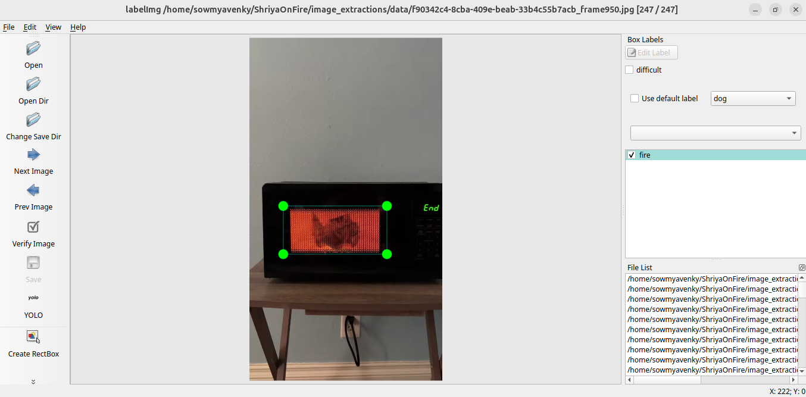

# Fire detection 

* Open a Conda prompt. Switch to the environment firedetection. 

<code>
conda create --name firedetection python=3.8 
conda activate firedetection

conda install -c pytorch -c conda-forge pytorch torchvision 

conda install -c conda-forge ultralytics

</code>

* We have scanned some homam videos and extracted frames out of them to get some training images of somewhat uncontrolled fires. Process the videos using the following command. It will create a frame every 50 frames and saves it to disk for use in labelling and training. 

<code>
python extract_homam_images.py "..\videos\homam1.mp4"

python extract_homam_images.py "..\videos\homam2.mp4"
</code>

* We now need to download some of the videos from youtube to get a good selection of types of fires we might encounter in a household. Using these diverse images can give us a good base for training the ML model.

<code>
python extract_homam_images.py "..\videos\kitchen1.mp4"

python extract_homam_images.py "..\videos\battery.mp4"

python extract_homam_images.py "..\videos\gas_cylinder.mp4"

python extract_homam_images.py "..\videos\gas_stove.mp4"

python extract_homam_images.py "..\videos\electric.mp4"

python extract_homam_images.py "..\videos\fireplace.mp4"

python extract_homam_images.py "..\videos\microwave.webm"

python extract_homam_images.py "..\videos\cigarate.mp4"

python extract_homam_images.py "..\videos\toaster.mp4"

python extract_homam_images.py "..\videos\electric_spark.mp4"

</code>

* Now we have to start labeling these images for use. For some reason this does not work very well within the conda virtual env. The qt5 version conflict for some reason. That is why it is better to oepn a new command prompt and use that to launch the labelImg. 

<code>
sudo apt-get install pyqt5-dev-tools

git clone https://github.com/tzutalin/labelImg

pip install pyqt5 lxml --upgrade

cd labelImg && pyrcc5 -o libs/resources.py resources.qrc

python labelimg.py 
</code>

* After the labelling of the images are done, there are 2 directories created under the data folder. The images folder will contain all our source images. the labels directory will contain a txt file for every image directory and will contain the bounding boxes for the classes we have labelled using the labelImg tool. The co-ordinates of the bounding box will follow the Yolo format since we have picked the format to be yolo based. 

* Now we need to train our model using the labels and images we have created in the system. 

python training.py --img 320 --batch 16 --epochs 5 --data fire_dataset.yml --weights yolov5s.pt --workers 2
